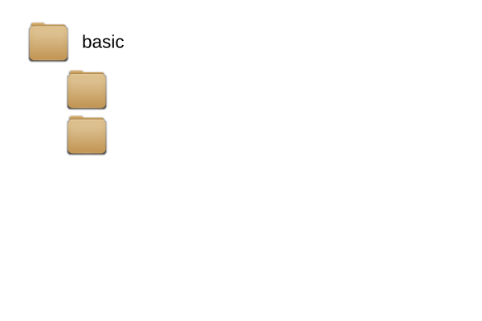

```{r echo = FALSE, message = FALSE} 
hasData <- requireNamespace("zdat", quietly = TRUE) 
if (!hasData) {
  knitr::opts_chunk$set(eval = FALSE)
  msg <- paste("Note: Examples in this vignette require that the", 
               "`zdat` package be installed. The system", 
               "currently running this vignette does not have that package", 
               "installed, so code examples will not be evaluated.")
  msg <- paste(strwrap(msg), collapse = "\n") 
  message(msg)
} 
```

```{r setup, echo=FALSE}
options(width = 120)
```

## 1. Zonation projects and zonator classes

The following examples will use the basic Zonation tutorial data as shipped with 
the [`zdat`](https://github.com/cbig/zdat) package. 
[The input and output files](https://github.com/cbig/zdat/tree/master/inst/extdata) 
in the tutorial package are arranged in a layout that has a specific logic behind it.
In Zonation jargon, everything within the root folder `basic` is consider to 
belong to the same **project** (see figure below). A project constitutes of one
or several **variants**. Each variant is an individual Zonation run with 
specific input biodidiversity features (defined in `01.spp`) and input 
parameters (defined in `01.dat`). All the configuration files needed for a run
are specified in a Windows batch file (`01_core_area_zonation.bat`). For
convience and clarity, input files required are placed in a subfolder named
after the variant. After the variant is run (in Zonation), the outputs of the
variant are placed in another subfolder (e.g. `01/01_out/`).   



All in all, the tutorial data has one project which has five variants (not all
are shown in the figure above for brevity). Note that 
these specification are just a useful convention and are not at all
required by Zonation (or zonator)! Note also that these specification are 
related to Zonation itself. Conceptually, `zonator` uses the same terminology
and the S4 classes in `zonator` follow the same logic. `zonator` provides a 
two functions `create_zproject()` and `load_zproject()` that can be used to:

1. Create a new Zonation project on the file system (`create_zproject()`)
1. Create zonator project based on existing Zonation project (`load_zproject()`)

`load_zproject()` works by parsing real input files on your file system 
(needed by Zonation) into R data structures. Formally, `load_zproject()` 
creates a new instance (object) of class `Zproject` with has specific 
attributes representing the Zonation project on the file system. Each variant
(see above) is parsed into an instance of class `Zvariant`. If a variant
already has results produced by Zonation, then these are parsed and mapped into
an instance of class `Zresults`.


Each class has specific methods that can be used to get and set attributes,
see documentation and the packages vignettes for more detailed description.

## 2. Create a new Zonation project

As mentioned above, `zonator` packages provides function `load_zproject()` 
that can be used to create all the necessary files and folders for a new 
Zonation project. Let's take a closer look:

```{r create-new-init, message=FALSE,warning=FALSE}
library(zonator)

# Create a (temporary) path to a new project. Basename component of this path
# will also be the name of the project.
project_path <- file.path(tempdir())

# Define the names of the variants within the project
variant_names <- c("01_variant", "02_variant", "03_variant")
```

```{r create-new-01, message=FALSE,warning=FALSE,eval=FALSE}
# Create a new project from scratch. Note that since we do not provide any 
# template file paths (for the .spp and .dat files), the templates shipped
# with the tutorial data will be used.
create_zproject(name = "test_project", dir = project_path, 
                variants = variant_names)
```

If you ran these examples on your own computer, you can now open path defined in 
`project_path` in your file browser to see what was created. Another useful 
option for `create_zproject()` is that it can scan the content of a given 
directory for raster (input biodiversity feature) files and construct a 
spp-file based on the file listing. Let's create a new project from scratch 
using input raster files shipped with the Zonation tutorial as a basis for the 
spp file. Since the input folder contains more rasters than just biodiversity 
files, we'll be using a file name filter. Note that we are still usingthe 
template .dat-file.

```{r create-new-02, message=FALSE,warning=FALSE,eval=FALSE}
# Directory containing the input raster files
input_raster_dir <- system.file("extdata/test_project/data", package="zonator")
new_project <- create_zproject(name = "test_project", dir = project_path, 
                               variants = variant_names,
                               spp_template_dir = input_raster_dir,
                               spp_file_pattern = "^species[0-9].tif$")
```

You can give extra arguments to `create_zproject()` that will be passed on to
creating the spp file. E.g. if you would want the set different weights to 
your biodiversity features, you could do the following:

```{r create-new-03, message=FALSE,warning=FALSE,eval=FALSE}
new_project <- create_zproject(name = "test_project", dir = project_path, 
                               variants = variant_names,
                               spp_template_dir = input_raster_dir,
                               spp_file_pattern = "^species[0-9].tif$",
                               weight = c(1, 1, 1, 2, 3, 2, 1)
```

Be careful with setting the weights (or other spp-file parameters such as the
alpha value), because no checking is being done!

## 3. Create zonator project based on existing data

Alternatively, all the information contained within an existing Zonation project 
can be parsed into R data structures. The tutorial data is not distributed with 
`zonator`, but in a separate package [`zdat`](https://github.com/cbig/zdat). You can - and 
must if you want to run the examples below - install the package by:

```{r install-zdat, eval=FALSE}
library(devtools)
devtools::install_github("cbig/zdat")
```

The tutorial data include results of the tutorial runs so there is no need  to run the 
variants in order to inspect the results. In case you *do* want to rerun the variants 
and you have Zonation installed in your system do so by running the following code. 
Otherwise just skip this code section.

```{r run-variant-1, eval=(1:6), message=FALSE}
library(zonator)

setup.dir <- system.file("extdata/basic", package = "zdat")

# Get all the bat-files
bat.files <- list.files(setup.dir, "\\.bat$", full.names = TRUE)

# Run all the runs
#for (bat.file in bat.files) {
#  run_bat(bat.file)
#}

```

You can create a new zonator project based on existing data by using 
`load_zproject()`:

```{r creat-zproject, message=FALSE}
tutorial.project <- load_zproject(setup.dir)
```

**Pro tip!** In case you have a complex Zonation project and want to keep track
which files are being read in while creating zproject, you can do 
`load_zproject(setup.dir, debug=TRUE)` in order to enable logging of file
reading sequence.

zonator also includes a utility function `opendir()` which takes a zproject
object as an argument and opens the file system folder containing the setup
files:

```{r opendir, eval=FALSE}
opendir(tutorial.project)
```

## 2. Working with variants

Individual variants (i.e. runs) can be extracted form the project using an 
index number. `nvariants()` will tell how many variants are included in the 
project.

```{r extract-variant}
nvariants(tutorial.project)
variant.1 <- get_variant(tutorial.project, 1)
```

Using an index number such as `1` is one option, but you can also use the name
of the variant. By default, zonator will assign the name of bat-file used to run
the run as a name, without the ".bat" extensions of course. `names()` will print 
the names of all the variants. Name can also be used to extract a variant.

```{r variants-by-name}
names(tutorial.project)
# Get first variant, 01_core_area_zonation
variant.caz <- get_variant(tutorial.project, "01")
```

Each variant object is an instance of class `Zvariant` and have a suite of 
useful methods for dealing with data parsed from various Zonation input files.

### 2.1 spp data

Zonation spp-file is one of the mandatory input files that always needs to be in
place and thus all variants have one. When a new `Zvariant` instance is created
the associated spp file is automatically parsed into it. All the spp data 
(with group code column if available) can be retrieved using `sppdata()`:

```{r sppdata}
sppdata(variant.caz)
```

You can check the number of features in spp file by using method `nfeatures()`:

```{r nfeatures}
nfeatures(variant.caz)
```

`Zvariant` objects have a couple of other convenience functions for quickly 
accessing columns in the spp file. For example, `sppweights()` can be used to 
extract the weight column in spp file:

```{r sppdata-weights}
# Note that all biodiversity features (species) have an equal weight of 1
sppweights(variant.caz)
```

Feature names from the spp file/data can be accessed directly by using method
`featurenames()`.

```{r sppdata-names-2}
featurenames(variant.caz)
```

The generated names are not necessarily very informative and can be changed to
new values. Remember that the names need to be valid data frame column names
(zontor will try to fix these even if you don't).

```{r sppdata-names-1}
featurenames(variant.caz) <- c("Koala", "Masked.owl", "Powerful.owl", 
                             "Tiger.quoll", "Sooty.owl", "Squirrel.glider",
                             "Yellow-bellied.glider")
featurenames(variant.caz)
# Or all the spp data
sppdata(variant.caz)
```

### 2.2 Groups

Notice that data frames returned by `sppdata()` in previous examples already had
a column called "group". This is because all tutorial variants have groups 
enabled by default. If a variant doesn't use groups, then this column will be
missing.

Group identities in Zonation input file are coded with integer values. Method
`groups()` will return just this integer vector:

```{r groups}
groups(variant.caz)
```

Groups can also have more informative names attached to them by using method
`groupnames()`. Even if you haven't names the groups used (Zonation does not
have a concept of named groups), generic group names "group1", "group2" etc. 
will automatically be created for `Zvariant` objects with groups enabled.

```{r group-names-1}
# By default, generic group names are used
groupnames(variant.caz)
```

The format for setting (mapping) group names is strict and involves a named 
character vector in which (column) names correspond to integer group codes and 
character elements the group names to be assigned:

```{r group-names-2}
# Construct a group name mapping using a named character vector
groupnames(variant.caz) <- c("1" = "mammals", "2" = "owls")
groupnames(variant.caz)
```

Now group 1 is labeled "mammals" and group 2 is labeled "owls". Note that 
`sppdata()` has an optional argument `group.names` that can be set to `TRUE`
if group names are preferable to group codes.

```{r sppdata-group-names}
sppdata(variant.caz, group.names = TRUE)
```

In addition to changing the group names, you can change the groups themselves 
as well. In the previous examples we had two groups named "mammals" (group code
= 1) and "owls" (group code = 2). Belonging to either one of these groups is 
controlled by the group ID code (an integer number) that can be accessed by
`groups()`:
 
 ```{r print-groups}
groups(variant.caz)
```
 
Method `groups()` can be used to set the group ID codes and thus the grouping. 
Let's say you want to split owls into two sub-groups called "big.owls" (group
code = 2) containing the Sooty owl and the Masked Owl and "small.owls" (group 
code = 3) containing the Powerful owl. Take again a look at the spp data:

```{r changing-groups-1}
sppdata(variant.caz)
```

What needs to be done is to change the group ID for the Powerful owl so that 
the group ID vector is changed into `1, 2, 3, 1, 2, 1, 1`. So do the following:

```{r changing-groups-2}
groups(variant.caz) <- c(1, 2, 3, 1, 2, 1, 1)
# Check the group ID codes
groups(variant.caz)
```

Note that after you change the group ID codes all the group names you may have
assigned get lost and are again replaced by generic "group1", "group2" etc. You
will have to manually set the group names again:

```{r changing-groups-3}
# Using generic group names after the group IDs have been changed
groupnames(variant.caz)
# Construct a new group names mapping
groupnames(variant.caz) <- c("1" = "mammals", "2" = "big.owls", 
                             "3" = "small.owls")
groupnames(variant.caz)
```

or check the whole spp data with group names:

```{r changing-groups-4}
sppdata(variant.caz, group.names = TRUE)
```
